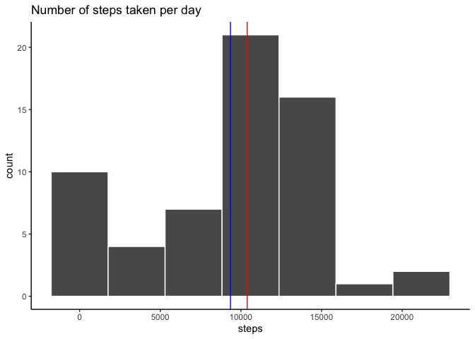
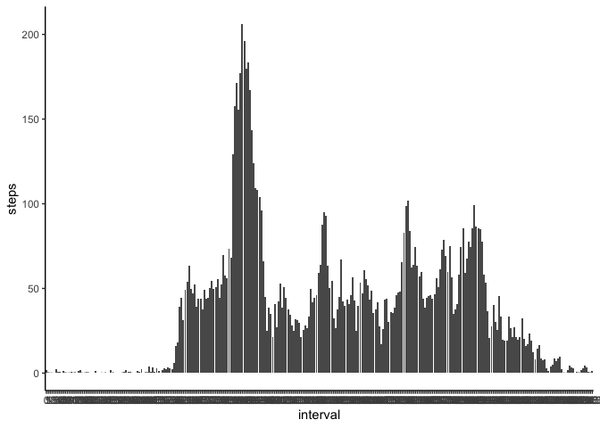
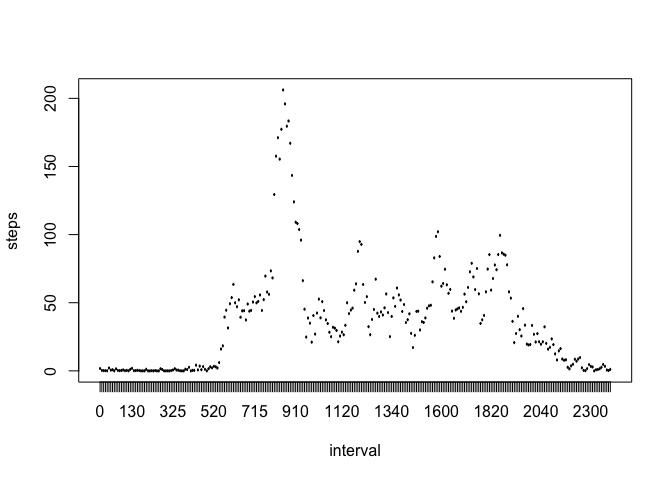
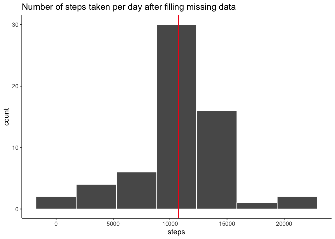
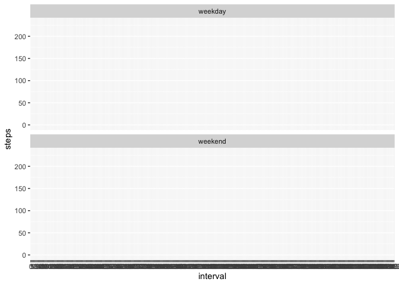

## Load and preprocesssing the data


```r
# load the data
raw_data <- read.csv('activity.csv', stringsAsFactors = FALSE)
# trasform date into character and interval into factor
raw_data$date <- as.Date.character(raw_data$date)
raw_data$interval <- as.factor(raw_data$interval)
```

## What is mean total number of steps taken per day?

```r
# calculate total number of steps taken per day
gr_data.d <- group_by(raw_data, date)
sum_data.d <- summarise(gr_data.d, steps = sum(steps, na.rm = TRUE))

# mean and median steps taken per day
mean.steps <- mean(sum_data.d$steps, na.rm = TRUE)
median.steps <- median(sum_data.d$steps, na.rm = TRUE)

# plot a histogramm of the total number steps taken per day with lines showing mean and median
ggplot(sum_data.d, aes(x = steps, fill = steps)) +
    geom_histogram(bins = 7, colour = "white") +
    geom_vline(xintercept = mean.steps, colour = "blue") +
    geom_vline(xintercept = median.steps, colour = "red") +
    scale_fill_brewer(palette = "Set1") +
    theme_classic() +
    labs(title = "Number of steps taken per day") +
    scale_color_manual(name = "Legenda", values = c("mean" = "blue", "median" = "red"))
```

<!-- -->

The mean (blue line) of steps taken per day is about 9354.

The median (red line) of steps taken per day is about 10395.

## What is the average daily activity pattern?


```r
# group data by interval and calculate average number of steps per interval
gr_data.i <-  group_by(raw_data, interval)

sum_data.i <- summarise(gr_data.i, steps = mean(steps, na.rm = TRUE))
# time series plot 
ggplot(sum_data.i, aes(x = interval, y =  steps)) +
    geom_col() +
    theme_classic() +
    scale_colour_brewer(palette = 1)
```

<!-- -->

```r
plot(sum_data.i, type = "l")
```

<!-- -->

```r
#points(sum_data.i$interval[sum_data.i$steps == max(sum_data.i$steps)], max(sum_data.i$steps), pch = 20)

max.act.interval <- sum_data.i$interval[sum_data.i$steps == max(sum_data.i$steps)]
max.steps <- max(sum_data.i$steps)
```

5-minute interval, on average across all the days in the dataset, containing the maximum number of steps (206 steps), is 835. 

## Imputing missing value.


```r
# calculate number of missing values in dataset
colSums(is.na(raw_data))
```

```
##    steps     date interval 
##     2304        0        0
```


```r
# vector of indexes of missing values
index_mis.steps <-  which(is.na(raw_data$steps))
# copy of raw dataset for transformation
full_data <- raw_data
# replace every NA value with mean for that 5-minute interval
for (i in index_mis.steps){
    mis.interval <- full_data[i,3]
    mean_mis.interval <- sum_data.i$steps[sum_data.i$interval == mis.interval]
    full_data$steps[i] <- mean_mis.interval
}

# calculate total number of steps taken per day
gr_fdata.d <- group_by(full_data, date)
sum_fdata.d <- summarise(gr_fdata.d, steps = sum(steps, na.rm = TRUE))

# mean and median number of steps taken per day
f.mean.steps <- mean(sum_fdata.d$steps)
f.median.steps <- median(sum_fdata.d$steps)

# plot a histogramm of the total number steps taken per day with lines showing mean and median
ggplot(sum_fdata.d, aes(x = steps, fill = steps)) +
    geom_histogram(bins = 7, colour = "white") +
    geom_vline(xintercept = f.mean.steps, colour = "blue") +
    geom_vline(xintercept = f.median.steps, colour = "red") +
    scale_fill_brewer(palette = "Set1") +
    theme_classic() +
    labs(title = "Number of steps taken per day after filling missing data ") 
```

<!-- -->

The mean (blue line) of steps taken per day after filling missing data is about 1.0766\times 10^{4}.

The median (red line) of steps taken per day after filling missing data is about 1.0766189\times 10^{4}. 

Both statistics have increased after imputing of missing data.

## Are there differences in activity patterns between weekdays and weekends?

```r
full_data$weekdays <- weekdays(full_data$date) 

full_data$weekdays  <- factor(full_data$weekdays, levels = c("Monday", "Tuesday",
        "Wednesday", "Thursday", "Friday", "Saturday", "Sunday"), labels = c("weekday",
        "weekday", "weekday", "weekday", "weekday", "weekend", "weekend"))

gr.fdata.w <- group_by(full_data, interval, weekdays)
sum.fdata.w <- summarise(gr.fdata.w, steps = mean(steps))

ggplot(sum.fdata.w, aes(x = interval, y = steps)) +
    geom_path () +
    facet_wrap(~ weekdays, nrow = 2)
```

```
## geom_path: Each group consists of only one observation. Do you need to adjust
## the group aesthetic?
## geom_path: Each group consists of only one observation. Do you need to adjust
## the group aesthetic?
```

<!-- -->


